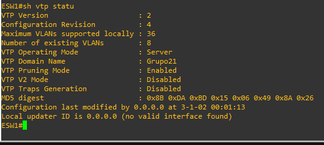
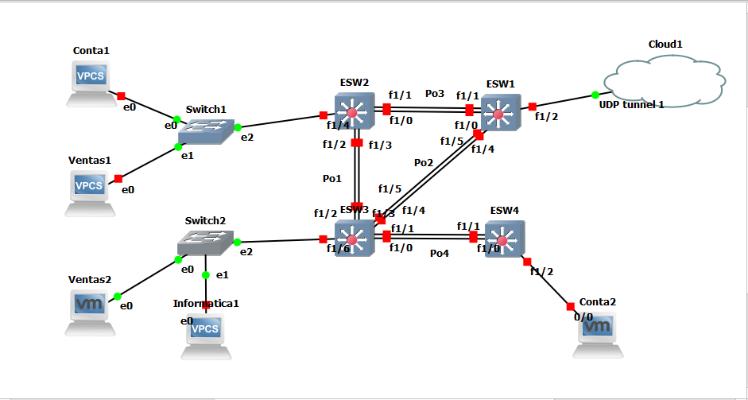

# **MANUAL DE CONFIGURACION**
## Topología 1
## Topología 2
La topología 2 es la encargada de distribuir y repartir las VLANS hacia las demás topologías, es el Cuarto de telecomunciaciones
### Configuración de la topología de red:
Componentes a utilizar:
- 4 Etherswitch Router
- 2 Cloud
Conexiones de la topologia: 

  

Podemos ver que los portchannels están configurados y la interface que se conecta a la nube en el ESW1 con el comando sh int trunk

  

Además el ESW1 es el que se configura en modo servidor y por lo tanto el encargado de suministrarle las VLANS creadas en este hacia los demas switchs, miramos esto con el comando sh vtp status

  

Para todos los demás switchs son configurados en modo cliente y las VLANs automáticamente son asignadas, como podemos ver el caso del ESW3 con el comando sh vlan-switch

  

Además de esto se le aplicó el Spanning Tree Protocol, esto nos ayuda a que no se enciclen los paquetes y pueda todo llegar a su destino, este fue configurado en el ESW1, lo cual genera un bloqueo de puertos en este caso en el  ESW2 y esto verifica que todo esté configurado correctamente

  

## Topología 3
Pasos para configurar la topologia 3.
### Configuración de la topología de red:
Componentes a utilizar:
- 5 VPC
- 2 Etherswitch
- 4 Etherswitch Router
- 1 Cloud

Conexiones de la topologia: 

  

### pruebas de ping:

Ping entre la VCP's de contabilidad:

  

  

Ping entre las VPC's de ventas:

  

  

### Configuracion por dispositivos:

Configuracion de Etherswitch router 1:

1. Configuracion de enlaces truncales y vlans:

  

2. Configuracion de port-channel:

  

Configuracion de Etherswitch router 2:

1. Configuracion de enlaces truncales y vlans:

  

2. Configuracion de port-channel:

  

Configuracion de Etherswitch router 3:

1. Configuracion de enlaces truncales y vlans:

  

2. Configuracion de port-channel:

  

Configuracion de Etherswitch router 4:

1. Configuracion de enlaces truncales y vlans:

  

2. Configuracion de port-channel:

  

3. Configuracion de enlace de acceso:

  

Configuracion de ip de VPC ventas1:

  

Configuracion de ip de VPC conta1:

  

Configuracion de ip de VM ventas2:

  

Configuracion de switch 1:

  

Configuracion de switch 2:

  

### Comandos utilizados:

Se utilizaron los siguientes comandos para configurar los etherswitch router:

1. Se utilizaron los siguientes comandos para configurar los EtherChannel:
  ~~~
  int range f#/# - #  //Se especifca el rango de interfaces
  channel-group # mode on // Se especifica el grupo al que perteneceran
  end
  ~~~
2. Se utilizaron los siguientes comandos para configurar enlaces truncales entre los etherswitch router:
  ~~~
  int Po#   //Se especifica el puerto
  switchport mode trunk //Se cambia a modo truncal
  switchport trunk allowed vlan 1,10,20,30,1002-1005  //Se especifican las vlans
  end
  ~~~
3. Se utlizaron los siguientes comandos para configurar los enlaces truncales entre los etherswitch router y los etherswitch:
  ~~~
  int f#/#   //Se especifica la interfaz
  switchport mode trunk //Se cambia a modo truncal
  switchport trunk allowed vlan 1,10,20,30,1002-1005  //Se especifican las vlans
  end
  ~~~
4. Se utilizaron los siguientes comandos para configurar los enlaces de acceso entre los etherswitch router y las VPC:
  ~~~
  int f#/# //Se especifica la interfaz
  switchport mode access  //Se cambia a modo acceso
  switchport access vlan # //Se especifica la vlan
  End
  ~~~
5. Se utilizaron los siguientes comandos para configurar VTP:
  ~~~
  vtp domain "nombre" // Se configura el nombre del dominio
  vtp password "contraseña" // Se configura la contraseña
  vtp mode client //Se cambia a modo cliente
  end
  ~~~
6. Se utlizaron los siguientes comandos para guardar los cambios en el Etherswitch router:
  ~~~
  copy run start
  write memory
  ~~~

Se utilizaron los siguientes comandos para configurar las VPC:
1. Se utlizo el siguiente comando para configurar la ip:
  ~~~
  "ip 'tu ip'/'Tu mascara de red' 'tu gateway'"
  ~~~
2. Se utlizo el siguiente comando para guardar los cambios:
  ~~~
  save
  ~~~

