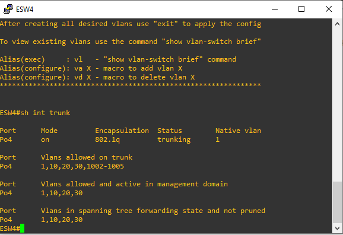

# **MANUAL DE CONFIGURACION**
## Topología 1
## Topología 2
## Topología 3
Pasos para configurar la topologia 3.
### Configuración de la topología de red:
Componentes a utilizar:
- 5 VPC
- 2 Etherswitch
- 4 Etherswitch Router
- 1 Cloud

Conexiones de la topologia: 

  

### Configuracion por dispositivos:
Configuracion de Etherswitch router 1:
1. Configuracion de enlaces truncales y vlans:

  

2. Configuracion de port-channel:

  

Configuracion de Etherswitch router 2:
1. Configuracion de enlaces truncales y vlans:

  

2. Configuracion de port-channel:

  

Configuracion de Etherswitch router 3:
1. Configuracion de enlaces truncales y vlans:

  

2. Configuracion de port-channel:

  

Configuracion de Etherswitch router 4:
1. Configuracion de enlaces truncales y vlans:

  

2. Configuracion de port-channel:

  

3. Configuracion de enlace de acceso:

  

Configuracion de ip de VPC ventas1:

  

Configuracion de ip de VPC conta1:

  

Configuracion de ip de VM ventas2:

  

Configuracion de switch 1:

  

Configuracion de switch 2:

  

### Comandos utilizados:

Se utilizaron los siguientes comandos para configurar los etherswitch router:

1. Se utilizaron los siguientes comandos para configurar los EtherChannel:
  ~~~
  int range f#/# - #  //Se especifca el rango de interfaces
  channel-group # mode on // Se especifica el grupo al que perteneceran
  end
  ~~~
2. Se utilizaron los siguientes comandos para configurar enlaces truncales entre los etherswitch router:
  ~~~
  int Po#   //Se especifica el puerto
  switchport mode trunk //Se cambia a modo truncal
  switchport trunk allowed vlan 1,10,20,30,1002-1005  //Se especifican las vlans
  end
  ~~~
3. Se utlizaron los siguientes comandos para configurar los enlaces truncales entre los etherswitch router y los etherswitch:
  ~~~
  int f#/#   //Se especifica la interfaz
  switchport mode trunk //Se cambia a modo truncal
  switchport trunk allowed vlan 1,10,20,30,1002-1005  //Se especifican las vlans
  end
  ~~~
4. Se utilizaron los siguientes comandos para configurar los enlaces de acceso entre los etherswitch router y las VPC:
  ~~~
  int f#/# //Se especifica la interfaz
  switchport mode access  //Se cambia a modo acceso
  switchport access vlan # //Se especifica la vlan
  End
  ~~~
5. Se utilizaron los siguientes comandos para configurar VTP:
  ~~~
  vtp domain "nombre" // Se configura el nombre del dominio
  vtp password "contraseña" // Se configura la contraseña
  vtp mode client //Se cambia a modo cliente
  end
  ~~~
6. Se utlizaron los siguientes comandos para guardar los cambios en el Etherswitch router:
  ~~~
  copy run start
  write memory
  ~~~

Se utilizaron los siguientes comandos para configurar las VPC:
1. Se utlizo el siguiente comando para configurar la ip:
  ~~~
  "ip 'tu ip'/'Tu mascara de red' 'tu gateway'"
  ~~~
2. Se utlizo el siguiente comando para guardar los cambios:
  ~~~
  save
  ~~~

